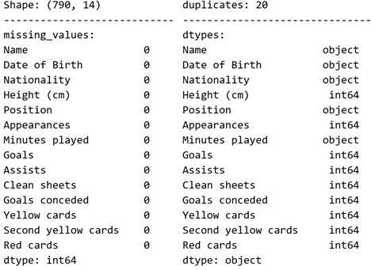
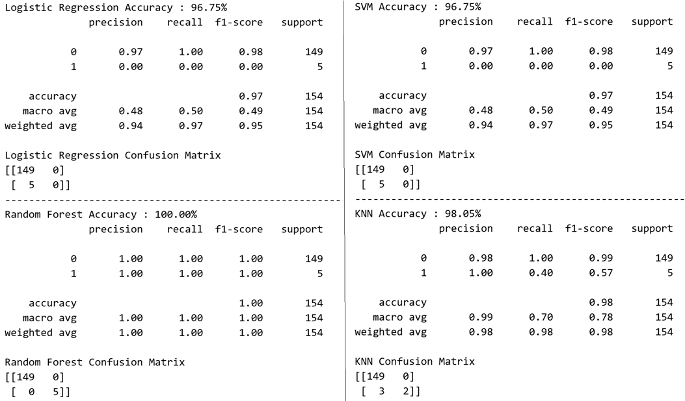
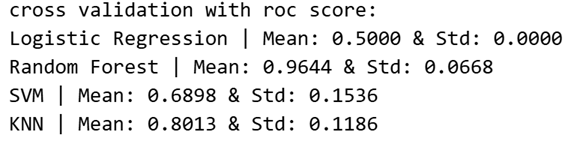
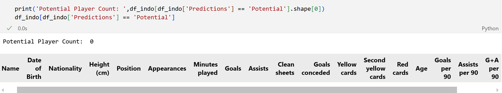
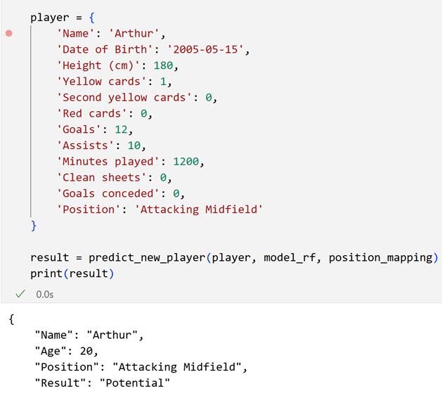

# ⚽ Football Talent Classification

A machine learning classification built in Python to scout a talented young **football player from a small league** deserves a move to a **top-tier league**.
The model uses various player statistics (goals, assists, minutes played, cards, etc.) to predict **“Potential”** (label 1) or **“Not Potential”** (label 0), based on historical performance data.

## 🌟 Steps

- Import Libraries
- Import League's xlsx
- Feature Cleaning
- Feature Labeling
- Machine Learning with Sklearn
- Parameter Tuning each Model
- Model Evaluation
- Predicts Player

## 📸 Screenshots







## 🛠️ Built With

- Python
- Jupyter Notebook
- Scikit-Learn
- Pandas and Numpy

## 📦 Installation

1. **Clone the repository**:

    ```bash
    git clone https://github.com/jordyyusim/football-talent-classification.git
    cd football-talent-classification 
    ```

2. **Create a virtual environment**:

    ```bash
    python -m venv yourenv
    source yourenv/bin/activate      # On Windows: yourenv\Scripts\activate
    ```

3. **Install the dependencies**:

    ```bash
    pip install -r requirements.txt
    ```

4.  **Launch Jupyter Notebook**:

    ```bash
    Jupyter notebook
    ```   

## 📬 Socials

[GitHub](https://github.com/jordyyusim) &nbsp;|&nbsp;
[LinkedIn](https://linkedin.com/in/jordyyusim) &nbsp;|&nbsp;
[X](https://x.com/jordyyusim)
